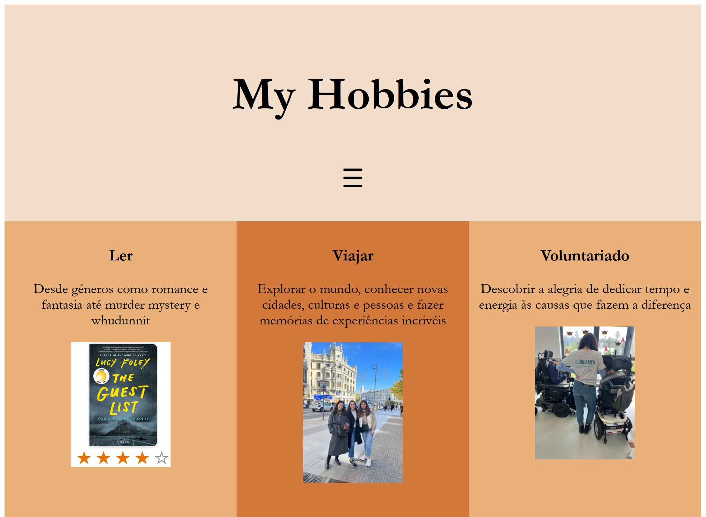
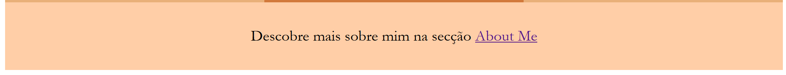
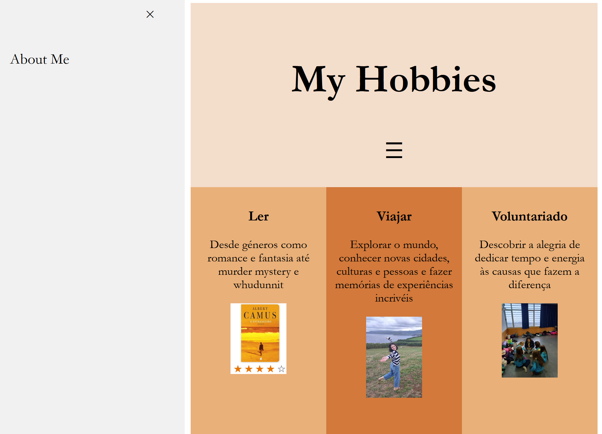
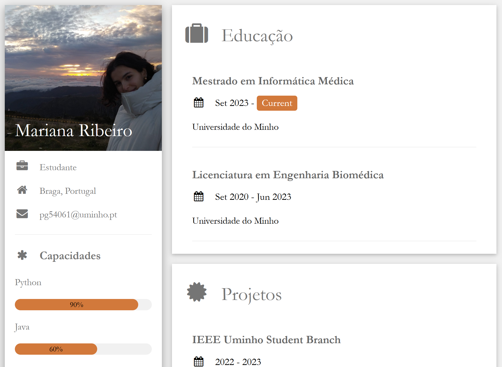
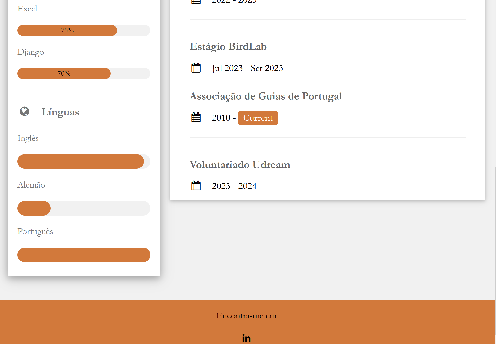

# TPC4

Processamento de Linguagem Natural - 4º ano Informática Médica

O objetivo deste TPC4 foi a criação de uma página html com informações de hobbies pessoais. 

No desenvolvimento do tpc, foi criada uma página inicial que tem apresenta um header, 3 colunas com informação sobre 3 hobbies e um footer. Em cada coluna foi apresentado um slideshow de várias imagens relacionadas, mostrando cada uma das imagens de 3 em 3 segundos. Para isso foi necessário desenvolver uma função que define o intervalo de tempo entre a passagens dos slides, isto é das imagens. 

De forma a desenvolver um menu, foram configuradas as definições de uma sidebar que abre "por cima" da página prinicipal, encolhendo-a. Para esta aba abrir e fechar foi também necessário utilizar 2 funções para abrir e fechá-la que essencialmente definem o tamanho desta aba/da página inicial.

O footer tem apenas uma ligação para a página about me referida mais a seguir.

O menu tem apenas uma opção, isto é, uma referência para uma outra página html, chamada aboutme.

Para explorar a utilização de templates CSS, esta segunda página aboutme utiliza uma template disponível em https://www.w3schools.com/w3css/w3css_templates.asp. Uma vez que a utilização de templates torna mais fácil este desenvolvimento, foi apenas necessário acrescentar a informação necessária. Adicionalmente, foi adicionada uma imagem e alteradas as cores da letra, do footer e de alguns containers. 

Por fim, no footer foi utilizado um dos icons disponibilizados pelo W3.CSS. A este footer foi associado um link para um perfil de linkedin.

Poderiam ter sido feitas algumas melhorias na página inicial, nomeadamente, a inserção de diferentes elementos. No entanto, uma vez que esta página foi criada de raiz, sem utilização de nenhuma template, foram encontradas algumas dificuldades, como por exemplo, a criação da sidebar, a tentativa de inserção de um vídeo e a utilização de alguns elementos (classes) W3.Css (uma vez que interferiam com algumas das configurações já estabelecidas). 