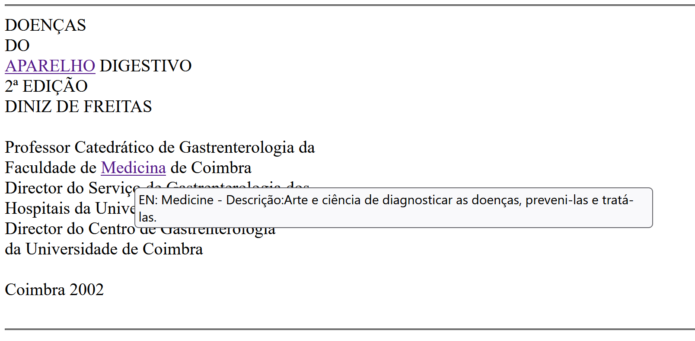

# TPC5

Processamento de Linguagem Natural - 4º ano Informática Médica

O objetivo do TPC5 foi a criação de uma página HTML que apresentasse o livro de Doenças do Aparelho Digestivo e apresentasse também para cada conceito contido no dicionário médico, uma tag com a sua tradução em inglês e a sua descrição, presente também no dicionário médico. 
Para isso foi necessária a abertura do dicionário designação/descrição já em formato json (realizado na aula), a abertura do livro em txt e a abertura do ficheiro de traduções, fornecido pelo professor.

De forma a associar os termos às suas traduções, foi utilizada a função findall com a expressão '\n?(.+)\s@\s(.+)'. Este padrão foi utilizado com o objetivo de obter uma lista de tuplos (termo, tradução). Para ser mais acessível a procura dos termos/traduções, foi transformada a lista num dicionário com  a designação como chave e a tradução como valor.  

Posteriormente, foi necessário estabelecer uma estrutura de dados para armazenar estas informações recolhidas, isto é, que mantivesse o termo, a designação e a tradução do termo. Foi então escolhido utilizar um dicionário *conceitos_min* com chave igual ao termo (em letras minúsculas) e valor um segundo dicionário com chaves 'designação' e 'en' (tradução) e valores as designações e o termo traduzido. De forma mais visual, a estrutura do dicionário seria:
{designação:{'descricao': descrição, 'en': tradução}}.

Para então poderem ser criadas tags para cada conceito que aparecesse no livro, foi utilizada a função etiquetador desenvolvida na aula que recebendo uma palavra (proviniente da utilização da função sub que encontra todas as palavras no livro) devolve a tag que deve ser utilizada pela mesma função sub. 

A maior dificuldade encontrada foi a tentativa de desenvolver o dicionário *conceitos_min* em compreensão uma vez que existiam palavras no dicionário conceitos que não constavam no dicionário de traduções, e, por isso, foi necessário utilizar uma condição no desenvolvimento deste dicionário.

Por fim, foi gerada a página html e testado o seu resultado tendo em conta o objetivo:

Foi também guardado o dicionário *conceitos_min* em formato json, bem como o dicionário de termos traduzidos para futura utilização.

