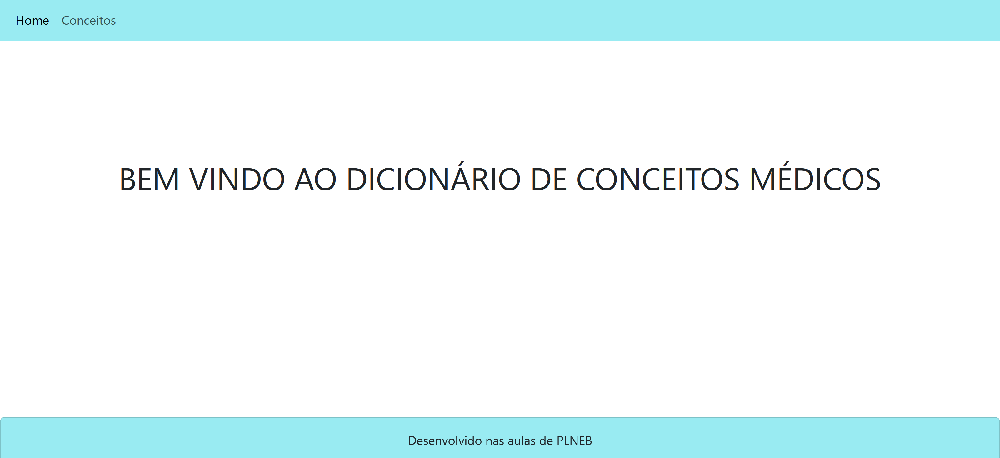
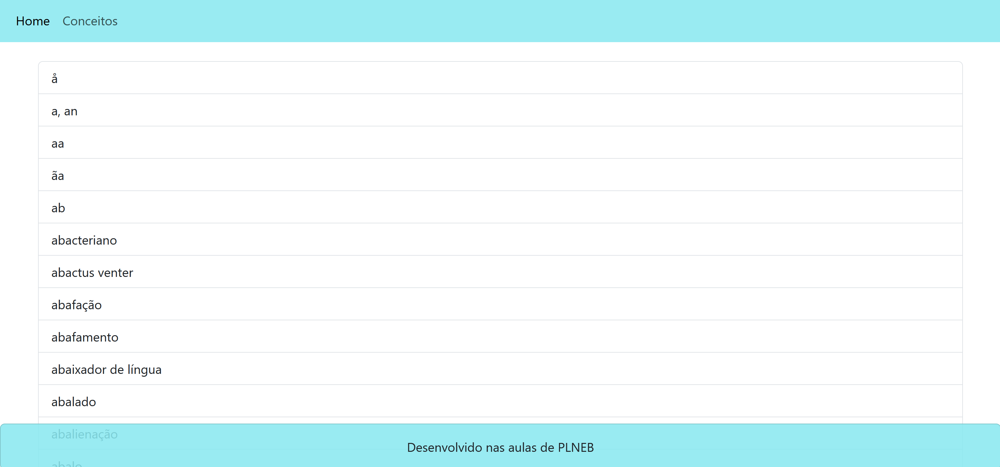
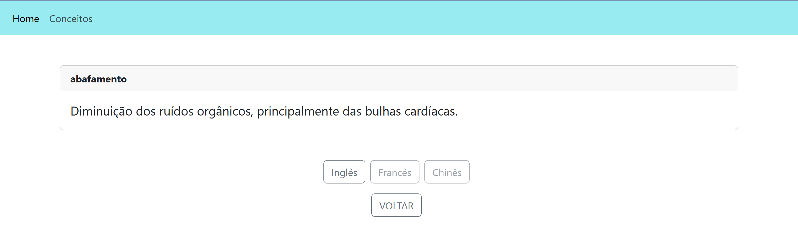
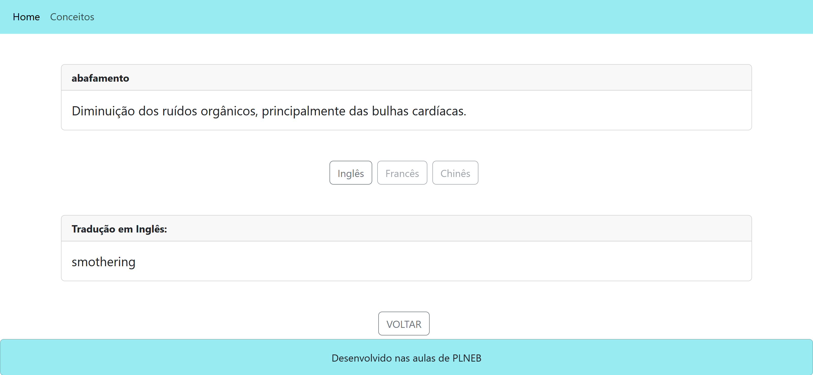

# TPC5

Processamento de Linguagem Natural - 4º ano Informática Médica

O objetivo do TPC5 foi o melhoramento da página html desenvolvida na aula que permitisse a visualização da descrição de cada conceito numa página html à parte.

Foram também acrescentados botões para permitir a visualização das traduções da designacao em inglês, francês e chinês. Uma vez que o dicionário de conceitos traduzidos não tem traduções em francês ou chinês, estes botões foram disabled.

O botão de voltar permite voltar para a página /conceitos. 

A maior dificuldade foi a criação do card text escondido para a tradução em inglês e também a associação da função flask à criação de um link específico para cada descrição.

Assim, foram explorados vários elementos html/bootstrap, melhorando o aspeto através da mudança da cor do blackground, e preparando a página para novas possíveis traduções.