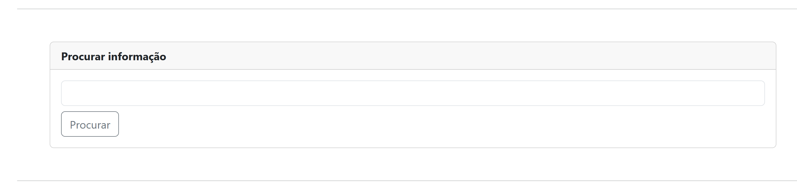
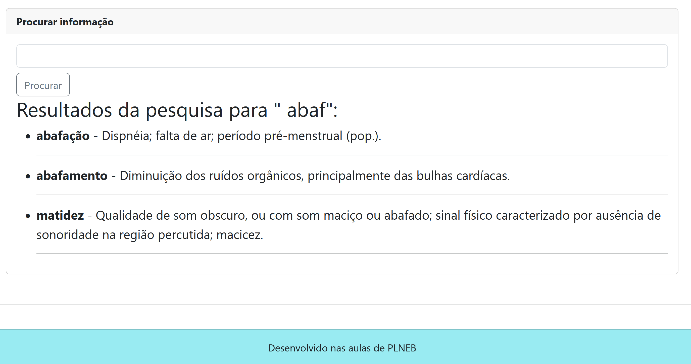
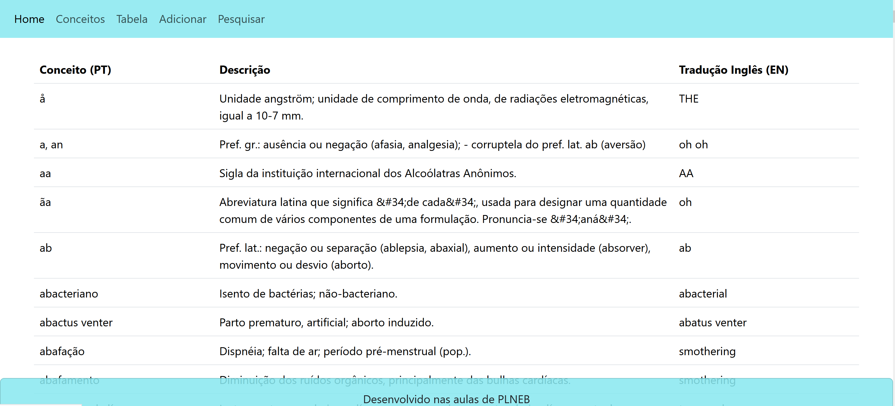
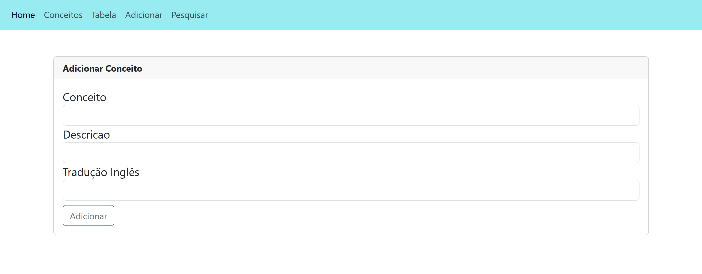
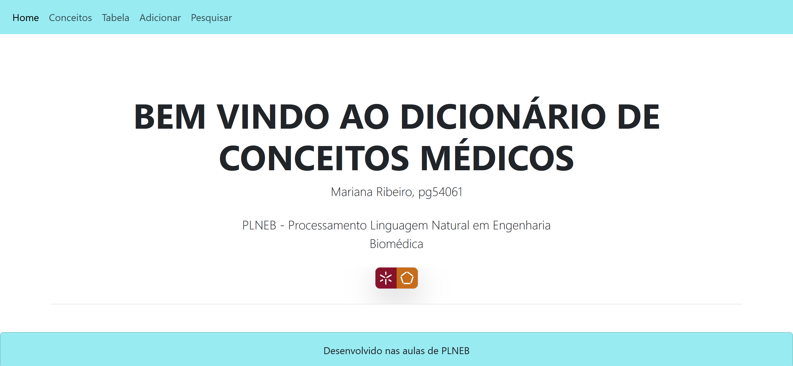

# TPC7

Processamento de Linguagem Natural - 4º ano Informática Médica

O objetivo do TPC7 foi o melhoramento da página html desenvolvida na aula que permitisse a pesquisa de informação nas designações e descrições através da utilização de formulários, e também a apresentação de toda a informação numa dataTable.

Para ser possível a pesquisa de informação foi necessário a criação de um cardbox com um formulário com método POST de forma a se poder introduzir a palavra a pesquisar. Neste caso, foi este cardbox e formulário à página conceitos.html. 

Foi também desenvolvida a função pesquisar_conceito que percorre toda a estrutura JSON conceitos, verificando a existência da palavra desejada nas chaves ou valores do dicionário. É de notar que esta função fornece os resultados numa lista, que será posteriormente percorrida para apresentação dos mesmos.

Quanto à apresentação dos resultados em tabela, esta foi conseguida através da implementação de uma DataTable com 3 colunas numa página chamada table.html. Para popular a tabela foi apenas necessário percorrer o dicionário passado na função table, apresentando a designação, descrição e tradução EN.

É de notar que também foram adicionados ao cabeçalho as referências para as diferentes funcionalidades desenvolvidas:

Por fim, foi melhorada a página inicial do Dicionário de Conceitos e melhorada  a funcionalidade "Adicionar Conceito".

